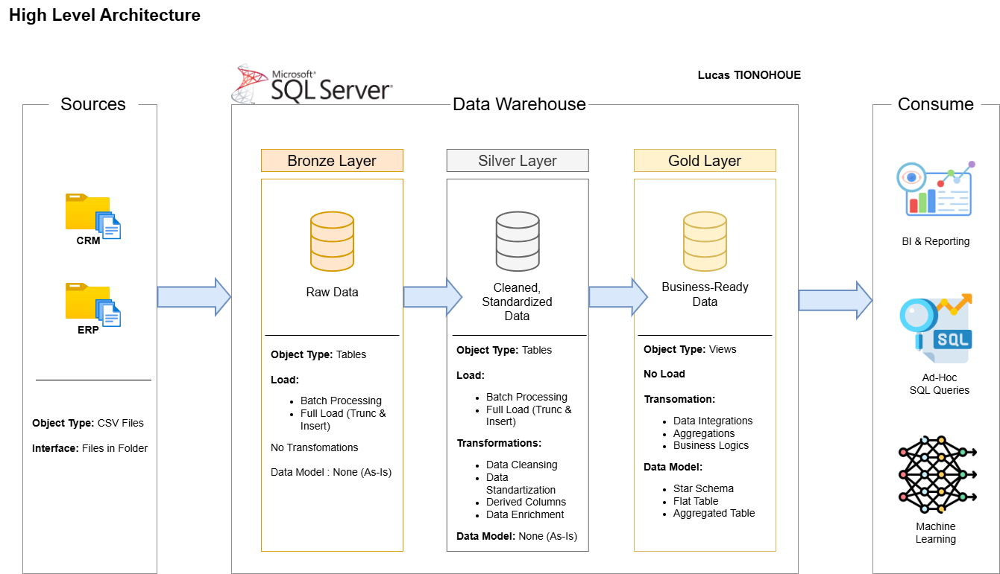

# SQL Data Warehouse

This project demonstrates a comprehensive data warehousing and analytics solution, from building a data warehouse to generating actionable insights.

---
## Data Architecture

The data architecture for this project follows Medallion Architecture **Bronze**, **Silver**, and **Gold** layers:

1. **Bronze Layer**: Stores raw data as-is from the source systems. Data is ingested from CSV Files into SQL Server Database.
2. **Silver Layer**: This layer includes data cleansing, standardization, and normalization processes to prepare data for analysis.
3. **Gold Layer**: Houses business-ready data modeled into a star schema required for reporting and analytics.

## Project Overview

This project involves:

1. **Data Architecture**: Designing a Modern Data Warehouse Using Medallion Architecture **Bronze**, **Silver**, and **Gold** layers.
2. **ETL Pipelines**: Extracting, transforming, and loading data from source systems into the warehouse.
3. **Data Modeling**: Developing fact and dimension tables optimized for analytical queries.
4. **Analytics & Reporting**: Creating SQL-based reports and dashboards for actionable insights.

## License

This project is licensed under the [MIT License](LICENSE). You are free to use, modify, and share this project with proper attribution.

## About Me

I’m a computer science student at Université de Montréal, passionate about data engineering, machine learning, and cloud architecture. I build real-world data pipelines, dashboards, and smart systems that solve actual business problems.

Currently focused on:
- Designing end-to-end data platforms (SQL, Airflow, dbt, AWS)
- Building ML-powered security tools and real-time analytics systems
- Improving my skills in MLOps and scalable AI deployment
